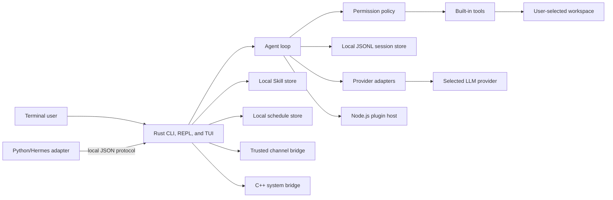

# Thinking Computer — Architecture

Thinking Computer is a local-first personal-agent CLI. Its primary execution process is a Rust binary with direct commands, a REPL, and a terminal UI. It has no required hosted control plane or graphical desktop app. A local webhook listener and a local continuous-improvement worker start only when the operator explicitly invokes them; neither is a silently installed background service. A provider connection is made only when the user asks the agent to complete a task using a configured model.

## Runtime structure



| Layer | Technology | Responsibility |
| --- | --- | --- |
| CLI and agent core | Rust | Argument parsing, interactive REPL, ratatui TUI, model orchestration, tool-call loop, local session memory, configuration, permissions, and error handling. |
| System bridge | C++17, compiled statically by Rust | A deliberately small cross-platform system-information bridge that proves a safe native integration boundary without transferring operating-system control out of Rust. |
| Python compatibility boundary | Python, local JSON over standard input/output | Receives compatibility requests and forwards them to the Rust engine; it never becomes a policy bypass. |
| Extension boundary | Node.js, JSON Lines over standard input/output | Isolated Plugin discovery and tool invocation. Manifests are validated in Rust before the host loads an ES module. |
| Providers and services | Rust HTTP adapters | Native OpenAI, Anthropic, Gemini, and Ollama adapters plus documented OpenAI-compatible routing profiles and optional service integrations. |
| Persistent state | Local files only | TOML configuration plus JSONL sessions, knowledge, capability profiles, pairings, schedules, Skill manifests, Plugin manifests, and audit records inside the operating-system data directory. |

## Workspace layout

The repository is a Cargo workspace with a small Node.js package and a Python adapter. The `thinking-computer` binary owns terminal interaction. `tc-core` intentionally has no direct terminal assumptions, so tests can run policy and request-building paths without live provider or channel calls.

```text
crates/
  thinking-computer/      CLI executable, commands, and REPL
  tc-core/                agent loop, config, providers, memory, permissions, tools, schedules, Skills, Plugins, channels
  tc-system-bridge/       safe Rust wrapper over the C++ bridge
native/system-bridge/     C++17 header and implementation
packages/plugin-host/     Node.js JSON-Lines plugin runner and a sample plugin
plugins/                  example plugin manifests
  docs/                     architecture, security, extension, channel, and provenance records
  automation/               bounded continuous-improvement worker and quality gates
scripts/                  install.sh and install.ps1
.github/workflows/        validation and release automation
```

## Agent protocol

Every provider adapter normalizes model output into text and zero or more tool calls. The agent loop executes a maximum number of steps, appends tool results to the current session, and asks the provider for the next step. The run ends when the model returns a final response or the step limit is reached. The default step limit is eight and can be changed only through an explicit CLI argument.

| Built-in capability | Default policy | Boundaries |
| --- | --- | --- |
| `read_file` | Allowed inside the selected workspace | Canonical paths outside the workspace are rejected. |
| `write_file` | Prompt before each write | Canonical paths outside the workspace are rejected. |
| `web_search` | Prompt before network access | Uses a public search endpoint only after approval; the result is treated as untrusted text. |
| `shell` | Prompt before every command | Runs in the selected workspace, records the command and exit status locally, and refuses clearly destructive root paths. No `sudo` elevation is added. |
| `inspect_system` | Prompt before a capability profile is captured | Reads a bounded VM profile and writes a local audit record. |
| `install_package` | Prompt before execution | Intended for an approved VM, never as an implicit dependency action. |
| Plugin tool | Denied until the capability is granted | The Rust core validates the manifest before invoking Node.js. |
| Channel dispatch and send | Prompt before delivery unless the operator used `--yes` | Inbound senders and outbound recipients use explicit local allowlists. |

> The model can propose actions; it never receives implicit authority to execute them. The terminal user remains the approval authority.

## Providers and credentials

The configuration file uses provider-specific sections. Environment variables override configuration-file values, which supports VPS and CI-like operation. Prefer environment variables for every credential; channel delivery refuses inline tokens and reads its credentials only from named environment variables.

| Provider | Environment variable | Default model | Tool-calling transport |
| --- | --- | --- | --- |
| Native | `OPENAI_API_KEY`, `ANTHROPIC_API_KEY`, `GEMINI_API_KEY`, or `OLLAMA_HOST` | Configured profile default | Native provider protocol |
| OpenAI-compatible routing | Provider-specific API-key environment variable | Configured profile default | OpenAI-compatible chat-completions transport |
| Optional services | Service-specific environment variable | Service-specific | Permission-gated service adapter |

## Local data model

The configuration and session locations are resolved through operating-system conventions. Linux uses XDG locations when available, macOS uses Application Support, and Windows uses AppData. Session files are append-only JSONL. Knowledge records, VM snapshots, and audit events are separate local artifacts. API keys, channel tokens, and raw outbound message content are never written to a session or audit record.

## Node.js plugin contract

A plugin directory contains `thinking-computer-plugin.json` and an ECMAScript module. The manifest declares a name, version, entry module, tool schemas, and requested capabilities. The Node.js host is launched by the Rust core for discovery or one invocation; it reads one JSON request from standard input and emits one JSON response to standard output. Plugin standard error is reserved for diagnostics, avoiding protocol corruption.

This design makes the extension ecosystem language-friendly without granting Node.js unbounded shell access. The host receives a narrow invocation payload, and only the Rust core can grant plugin capabilities or perform privileged built-in tools.

## Cross-platform delivery

Release automation creates native binaries for Linux x86_64, macOS x86_64 and ARM64, and Windows x86_64. The Unix installer detects the current operating system and architecture, retrieves the matching signed release archive, verifies a published SHA-256 checksum, and installs `thinking-computer` into a user-owned directory. The PowerShell installer follows the equivalent Windows flow. Node.js is required only when the user enables Node.js plugins.

## Deliberate non-goals

Thinking Computer intentionally excludes a hosted agent account system, remote session synchronization service, a general-purpose personal-device controller, and unattended command execution without an approved VM and quality gates. The project has a documented local webhook and channel bridge but does not claim that every third-party messaging platform has a safe direct core adapter. These boundaries keep the tool inspectable, practical on a VPS, and safe by default.
