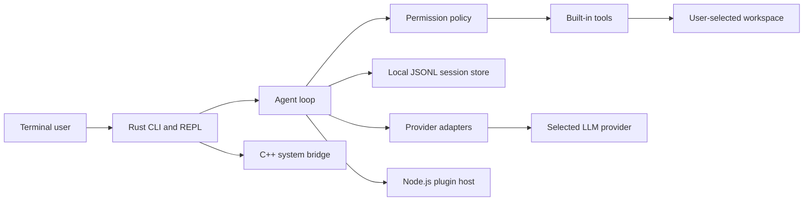

# Thinking Computer — Architecture

Thinking Computer is a local-first personal-agent CLI. Its primary execution process is a Rust binary; it has no HTTP server, graphical interface, background daemon, or cloud backend. A provider connection is made only when the user asks the agent to complete a task using a configured model.

## Runtime structure



| Layer | Technology | Responsibility |
| --- | --- | --- |
| CLI and agent core | Rust | Argument parsing, interactive REPL, model orchestration, tool-call loop, local session memory, configuration, permissions, and error handling. |
| System bridge | C++17, compiled statically by Rust | A deliberately small cross-platform system-information bridge that proves a safe native integration boundary without transferring operating-system control out of Rust. |
| Extension boundary | Node.js, JSON Lines over standard input/output | Isolated plugin discovery and tool invocation. A plugin cannot act unless the Rust policy layer grants the named capability. |
| Providers | Rust HTTP adapters | OpenAI, Anthropic, Gemini, and Ollama adapters which convert a provider response into one neutral `ToolCall` model. |
| Persistent state | Local files only | TOML configuration plus JSONL sessions inside the operating-system data directory. No external database or service is required. |

## Workspace layout

The repository will be a Cargo workspace with a small Node.js package. The `thinking-computer` binary owns all user interaction. `tc-core` intentionally has no direct terminal assumptions, so tests can run the agent flow with a fake provider and scripted approvals.

```text
crates/
  thinking-computer/      CLI executable, commands, and REPL
  tc-core/                agent loop, config, providers, memory, permissions, tools
  tc-system-bridge/       safe Rust wrapper over the C++ bridge
native/system-bridge/     C++17 header and implementation
packages/plugin-host/     Node.js JSON-Lines plugin runner and a sample plugin
plugins/                  example plugin manifests
docs/                     architecture, security, and upstream record
scripts/                  install.sh and install.ps1
.github/workflows/        validation and release automation
```

## Agent protocol

Every provider adapter normalizes model output into text and zero or more tool calls. The agent loop executes a maximum number of steps, appends tool results to the current session, and asks the provider for the next step. The run ends when the model returns a final response or the step limit is reached. The default step limit is eight and can be changed only through an explicit CLI argument.

| Built-in capability | Default policy | Boundaries |
| --- | --- | --- |
| `read_file` | Allowed inside the selected workspace | Canonical paths outside the workspace are rejected. |
| `write_file` | Prompt before each write | Canonical paths outside the workspace are rejected. |
| `web_search` | Prompt before network access | Uses a public search endpoint only after approval; the result is treated as untrusted text. |
| `shell` | Prompt before every command | Runs in the selected workspace, records the command and exit status locally, and refuses clearly destructive root paths. No `sudo` elevation is added. |
| Plugin tool | Denied until the capability is granted | The Rust core checks a plugin's declared tool and capability before invoking Node.js. |

> The model can propose actions; it never receives implicit authority to execute them. The terminal user remains the approval authority.

## Providers and credentials

The configuration file uses provider-specific sections. Environment variables override configuration-file values, which allows secure deployment on VPS hosts and CI-like environments. A key may be stored directly in the local file only if the user chooses to do so; the CLI warns and attempts to set restrictive permissions on supported systems.

| Provider | Environment variable | Default model | Tool-calling transport |
| --- | --- | --- | --- |
| OpenAI | `OPENAI_API_KEY` | `gpt-4.1-mini` | Chat Completions tools format |
| Anthropic | `ANTHROPIC_API_KEY` | `claude-3-5-haiku-latest` | Messages tool-use blocks |
| Gemini | `GEMINI_API_KEY` | `gemini-2.5-flash` | Function declarations and function-call parts |
| Ollama | `OLLAMA_HOST` | `llama3.2` | Local `/api/chat` tools format |

## Local data model

The configuration and session locations are resolved through operating-system conventions. Linux uses XDG locations when available, macOS uses Application Support, and Windows uses AppData. Session files are append-only JSONL with an adjacent metadata file. Each record stores the role, timestamp, content, and optional tool audit information; API keys are never written to a session record.

## Node.js plugin contract

A plugin directory contains `thinking-computer-plugin.json` and an ECMAScript module. The manifest declares a name, version, entry module, tool schemas, and requested capabilities. The Node.js host is launched by the Rust core for discovery or one invocation; it reads one JSON request from standard input and emits one JSON response to standard output. Plugin standard error is reserved for diagnostics, avoiding protocol corruption.

This design makes the extension ecosystem language-friendly without granting Node.js unbounded shell access. The host receives a narrow invocation payload, and only the Rust core can grant plugin capabilities or perform privileged built-in tools.

## Cross-platform delivery

Release automation creates native binaries for Linux x86_64, macOS x86_64 and ARM64, and Windows x86_64. The Unix installer detects the current operating system and architecture, retrieves the matching signed release archive, verifies a published SHA-256 checksum, and installs `thinking-computer` into a user-owned directory. The PowerShell installer follows the equivalent Windows flow. Node.js is required only when the user enables Node.js plugins.

## Non-goals for the first release

The first release intentionally excludes a web console, graphical desktop application, hosted account system, remote session synchronization, messaging-channel gateway, and unattended command execution. These boundaries keep the tool inspectable, practical on a VPS, and safe by default.
